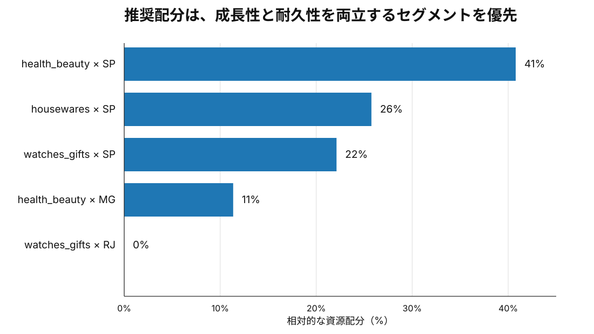
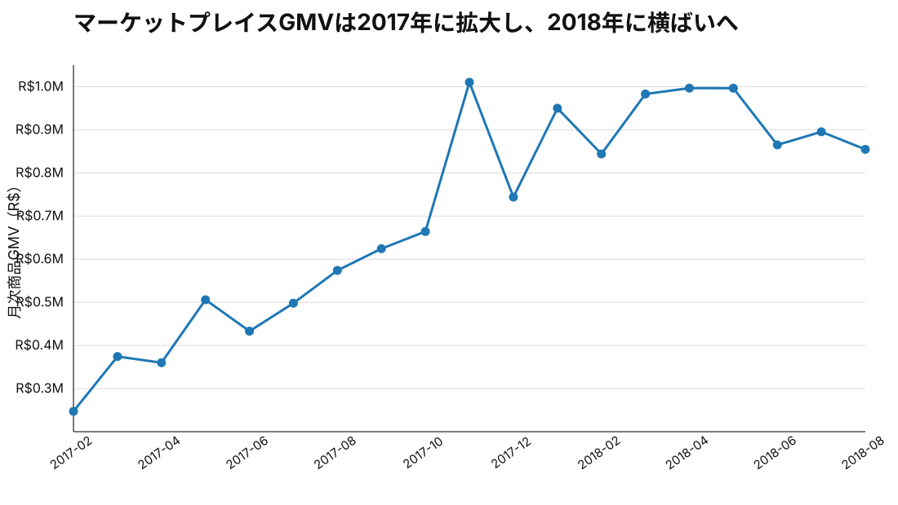
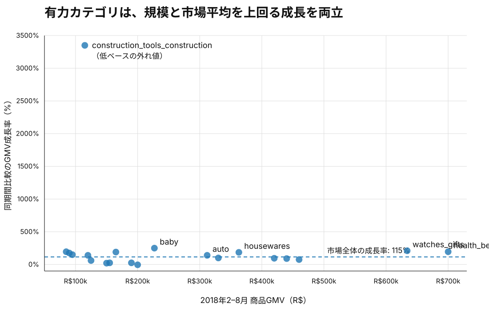
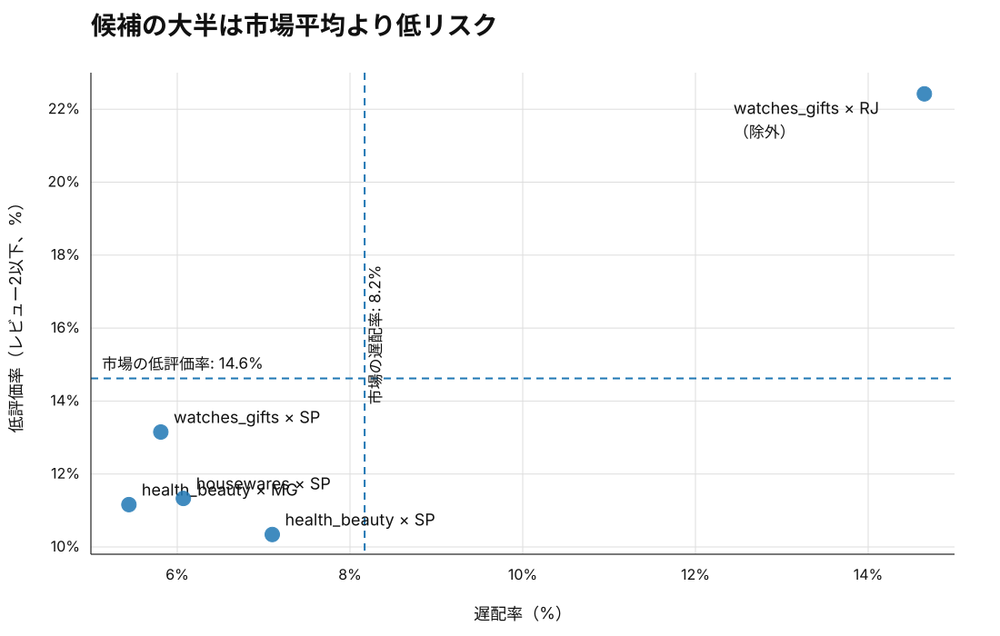

# 投資デューデリジェンスと成長戦略

> Olist公開データを用いて、データ監査、市場・カテゴリ・地域分析、リスク評価、不確実性評価、資源配分、最終投資判断までを一貫して行った商業デューデリジェンスです。

## 最終判断

**WAIT — 財務ユニットエコノミクスの検証待ち**

商業面・運用面では、選択的な投資を支持する結果が得られました。一方、公開データにはtake rate、margin、CAC、追加投資額、cash flowに関する情報が含まれておらず、ROI / IRRを算定できません。

* **商業デューデリジェンス：GO**
* **財務デューデリジェンス：未完了**
* **最終判断：WAIT**

財務デューデリジェンスを通過した場合の相対的な資源配分優先度は次のとおりです。



| 順位 | セグメント                          |       相対配分 |
| -: | ------------------------------ | ---------: |
|  1 | **health_beauty × SP**         | **28.71%** |
|  2 | **bed_bath_table × SP**        | **18.39%** |
|  3 | **sports_leisure × SP**        | **18.20%** |
|  4 | **housewares × SP**            | **18.13%** |
|  5 | **computers_accessories × SP** | **16.58%** |

> この配分は期待収益率や最適な資本配分を表すものではありません。観測された市場規模、GMV絶対増加額、GMVシェア変化、運用品質、販売者の分散度に基づく**相対的な資源配分優先度**です。

---

## ビジネス上の問い

> **このマーケットプレイスへ投資すべきか。投資候補が存在するなら、どのカテゴリ・地域を優先し、どの条件で投資仮説を撤回すべきか。**

分析フロー：

```text
ビジネス課題
→ 判断基準
→ 指標体系
→ データ監査
→ 診断分析
→ 候補選定
→ リスク評価
→ 資源配分
→ 不確実性・頑健性評価
→ 投資判断
```

目的はSQLやPythonを使用すること自体ではなく、**不完全な観測データから何を判断でき、何を判断できないかを切り分けること**です。

---

# 1. 市場全体



商品GMVは2017年に急拡大し、2018年には横ばい化する兆候があります。AOVには明確な上昇傾向がなく、成長は主にアクティブ顧客数と注文数の増加によって説明されます。

90日以内のリピート率も低く、市場成長は新規顧客獲得への依存が大きいと解釈します。

したがって、2017年の高成長率を将来へ単純に外挿せず、市場全体への一律投資ではなく、投資対象セグメントを選別します。

---

# 2. カテゴリ・地域別の投資機会



比較期間は、季節性の影響を抑えるため同一暦月にそろえます。

```text
Prior:   2017-02-01 <= purchase < 2017-09-01
Current: 2018-02-01 <= purchase < 2018-09-01
```

## 候補選定を手入力から機械生成へ変更

旧版では候補となる `category × state` をSQLへ直接記述していました。この方法では候補選定に分析者の裁量が残るため廃止しました。

現在は、**すべての `category × customer_state`** に同一の選定基準を適用します。

```text
両比較期間で観測
→ Current GMV >= 95th percentile
→ Current orders >= 100
→ GMV絶対増加額 > 0
→ GMVシェア変化 > 0
→ 運用品質のリスク除外基準
→ 投資候補
```

95パーセンタイルと100 ordersはデータから推定された自然な定数ではなく、意思決定のために設定した選定上の仮定です。そのため、後段で閾値に対する感応度を確認します。

---

# 3. 運用リスク



配送遅延率と低評価率は注文単位で定義します。

```math
\mathrm{LateRate}
=
\frac{
\mathrm{LateOrders}
}{
\mathrm{LateDeliveryEligibleOrders}
}
```

```math
\mathrm{LowReviewRate}
=
\frac{
\mathrm{ReviewScore}\le2
}{
\mathrm{ReviewEligibleOrders}
}
```

機会選定基準を通過したセグメントのうち、次の2条件が**同時に**市場全体の基準値より悪いものを除外します。

```math
\mathrm{LateRate}_s
>
\mathrm{LateRate}_{\mathrm{market}}
```

かつ、

```math
\mathrm{LowReviewRate}_s
>
\mathrm{LowReviewRate}_{\mathrm{market}}
```

代表例として `watches_gifts × RJ` は、成長機会は大きいものの両方のリスクKPIが市場全体より悪く、リスク除外基準を通過しません。

---

# 4. 最有力セグメント

機械的な候補選定後も、**health_beauty × SP** が1位です。

| 指標                        |                  結果 |
| ------------------------- | ------------------: |
| 2018年2–8月 Merchandise GMV |       **R$275,923** |
| GMV絶対増加額                  |      **+R$205,740** |
| GMV成長率                    |           **+293%** |
| 配送遅延率                     |           **7.10%** |
| 配送遅延率 95% CI              |  **[6.31%, 7.97%]** |
| 市場全体の配送遅延率                |           **8.17%** |
| 低評価率                      |          **10.34%** |
| 低評価率 95% CI               | **[9.41%, 11.36%]** |
| 市場全体の低評価率                 |          **14.62%** |
| Top-3 seller GMV share    |          **21.78%** |

比率KPIについては点推定値だけでなく、標本不確実性をWilson 95%信頼区間として明示します。

---

# 5. 資源配分ロジック

基準スコアは、説明可能性を優先したヒューリスティックな指標です。

```math
\mathrm{Score}_s =
\mathrm{GMV}_s^{0.5}
\Delta \mathrm{GMV}_s^{0.5}
(1-\mathrm{Concentration}_s)
```

ここで、

* `GMV` = Current比較期間におけるMerchandise GMV
* `ΔGMV` = Prior比較期間からCurrent比較期間へのGMV絶対増加額
* `Concentration` = Current比較期間におけるTop-3 seller GMV share

を表します。

リスク除外後に残ったセグメントをスコア順に並べ、上位5セグメントを最終ポートフォリオとして採用し、各スコアの比率に基づいて相対配分へ正規化します。

このモデルは投資リターンを構造的に推定するモデルではないため、**平方根変換や販売者集中度へのペナルティ設定そのものも検証対象**とします。

---

# 6. 統計的不確実性と頑健性

## 6.1 Wilson 95%信頼区間

配送遅延率と低評価率にはWilson intervalを使用します。

```math
\mathrm{CI}_{\mathrm{Wilson}}
=
\frac{
\hat p + z^2/(2n)
\pm
z\sqrt{\hat p(1-\hat p)/n + z^2/(4n^2)}
}{
1+z^2/n
}
```

`z = 1.959964` を使用します。

これにより、たとえば `health_beauty × SP` について「7.10% vs 8.17%」という点推定値だけではなく、その推定幅まで示します。

## 6.2 スコア仕様に対する頑健性

基準スコアを以下の一般形へ拡張します。

```math
\mathrm{Score}_s(\alpha,\beta,\gamma)
=
\mathrm{GMV}_s^{\alpha}
\Delta \mathrm{GMV}_s^{\beta}
(1-\mathrm{Concentration}_s)^{\gamma}
```

評価するパラメータの組合せは以下のとおりです。

```text
alpha ∈ {0.25, 0.50, 0.75, 1.00}
beta  ∈ {0.25, 0.50, 0.75, 1.00}
gamma ∈ {0.00, 0.50, 1.00, 1.50, 2.00}
```

合計**80通りのスコア仕様**を評価します。

再計算の結果、**health_beauty × SPは80/80の仕様で1位**を維持しました。

したがって、最有力候補という結論は、「平方根を使用したから」「Top-3 seller concentrationに線形ペナルティを与えたから」といった特定の1つのモデル仕様だけには依存していません。

## 6.3 候補選定基準に対する感応度

候補選定で使用する閾値も不確実性として扱います。

```text
Current GMV percentile ∈ {90, 92.5, 95, 97.5}
Minimum current orders ∈ {50, 100, 200}
```

合計12条件を評価し、`health_beauty × SP` が機会選定基準から脱落しないかを確認します。

---

# 7. ROI / IRRを算出しない理由

Olist公開データには、以下の情報が含まれていません。

* take rate
* net revenue
* gross margin / contribution margin
* CAC
* marketing spend
* seller acquisition cost
* 追加投資額
* cash flow

さらに、投資によって生じる追加GMVの因果効果も識別できません。

したがって、ROI / IRR / expected profitを直接算出すると、データが裏付けていない精密さを与えることになります。

商業デューデリジェンスでは**どのセグメントへ優先的に資源を配分するか**を評価し、財務デューデリジェンスでは**その投資が必要なリターン水準を満たすか**を検証する役割に分離します。

---

# 8. WAITからINVESTへ移行する条件

追加で以下の情報を取得・検証します。

1. セグメント別take rate
2. contribution margin
3. CAC
4. 顧客別contribution LTV
5. 販売者獲得に関する採算性
6. 追加のmarketing / operating investment
7. 投資による追加GMVの期待効果

これらを取得し、投資ハードルを満たすことを確認した場合に、判断を `INVEST` へ変更します。

---

# 9. 再評価・撤退トリガー

* 比較対象期間におけるGMV絶対増加額 <= 0
* セグメントGMVシェアが継続的に低下
* 配送遅延率と低評価率の両方が市場全体の基準値を上回る
* 販売者集中度の悪化により順位がモデル仕様へ強く依存する
* アクティブ顧客数またはGMVが継続的に減少し、リピート購入で補えない

---

# 10. 再現方法

実行順序：

```bash
python src/run_sql.py sql/00_data_audit.sql
python src/run_sql.py sql/01_analysis_base.sql
python src/run_sql.py sql/02_diagnostic_growth.sql
python src/run_sql.py sql/03_diagnostic_category.sql
python src/run_sql.py sql/04_diagnostic_region.sql
python src/run_sql.py sql/05_diagnostic_risk.sql
python src/run_sql.py sql/06_allocation.sql
python src/run_sql.py sql/07_uncertainty.sql
python src/make_figures.py
```

主な生成物：

```text
data/processed/order_base.parquet
data/processed/item_base.parquet
data/processed/opportunity_candidates.parquet
data/processed/candidate_risk.parquet
data/processed/allocation_recommendation.parquet
data/processed/risk_confidence_intervals.parquet
data/processed/specification_ranks.parquet
```

詳細な分析方法は `docs/analysis_methodology.md`、最終的な投資判断は `docs/investment_decision.md` を参照してください。
