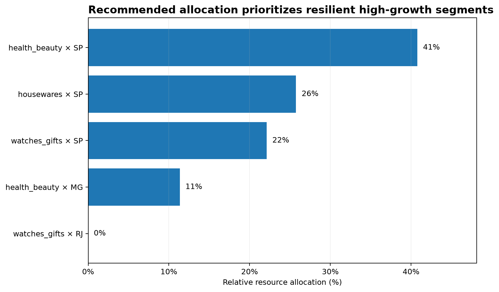
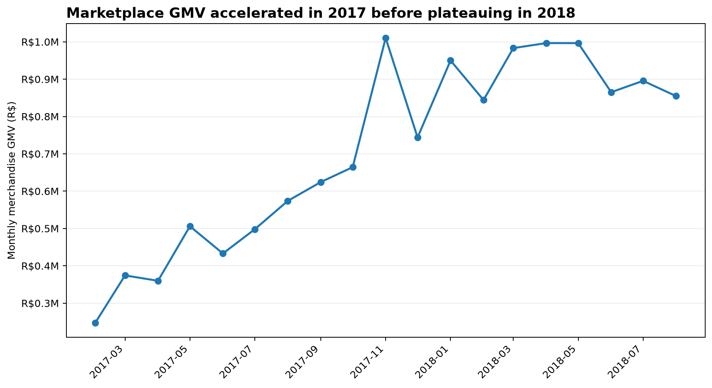
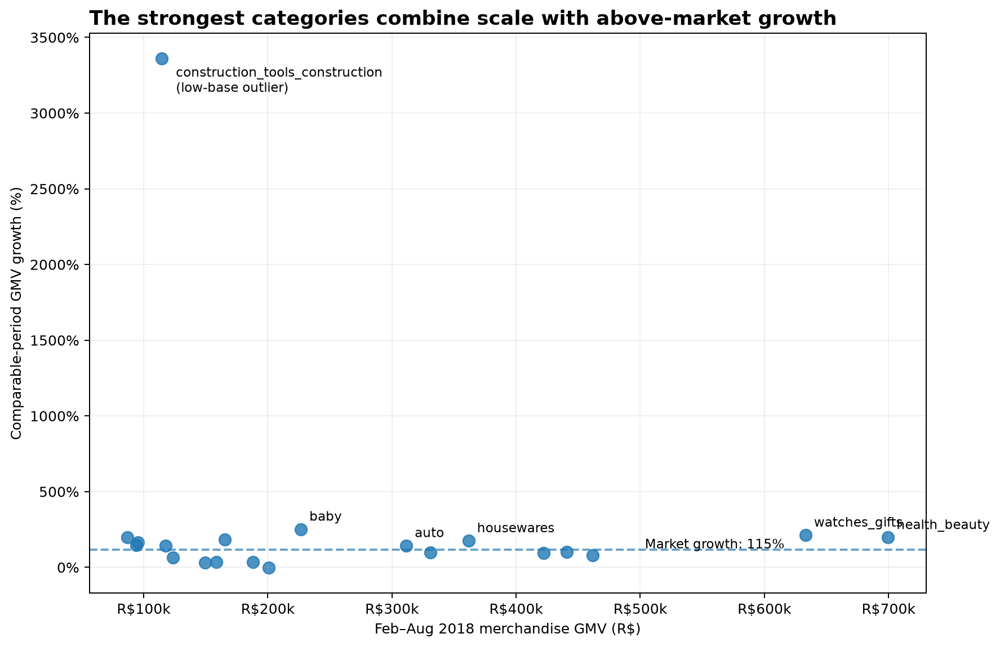
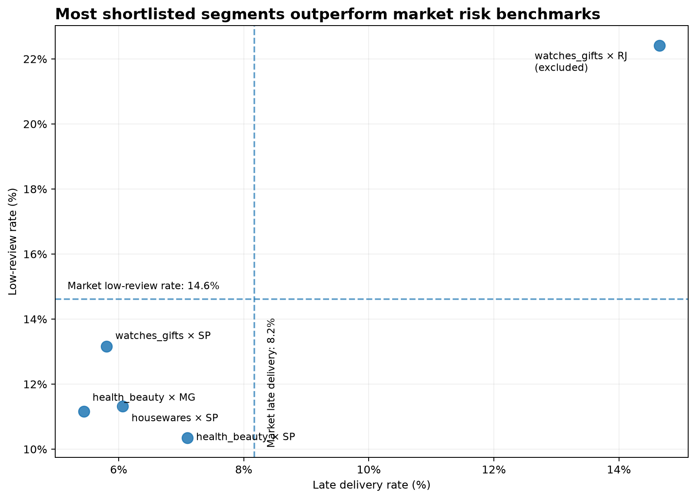

# Investment Due Diligence & Growth Strategy

> End-to-end investment analysis of the Brazilian e-commerce marketplace represented by the Olist public dataset — from raw-data audit to segment screening, downside-risk analysis, and resource-allocation recommendation.

---

## Executive Decision

# WAIT — Pending Financial Unit-Economics Validation

The commercial and operational evidence supports **selective investment**, but the available public dataset does not contain the financial variables required to establish whether incremental capital would generate an acceptable return.

The analysis therefore reaches two separate conclusions:

* **Commercial DD: GO** — attractive category × region opportunities exist.
* **Financial DD: INCOMPLETE** — ROI / IRR cannot be identified from the available data.
* **Final investment decision: WAIT** until unit economics are validated.

If financial due diligence confirms acceptable economics, the recommended **relative resource-allocation priority** is:



| Priority           | Segment                | Relative Allocation |
| ------------------ | ---------------------- | ------------------: |
| Core               | **health_beauty × SP** |          **40.78%** |
| Core               | **housewares × SP**    |          **25.75%** |
| Higher-risk growth | **watches_gifts × SP** |          **22.12%** |
| Expansion          | **health_beauty × MG** |          **11.35%** |
| Excluded           | watches_gifts × RJ     |              **0%** |

These percentages are **not expected financial returns or literal optimal capital weights**. They represent relative allocation priority based on observed demand growth, operational quality, and seller diversification.

---

# Business Question

> **Should we invest in this marketplace opportunity? If so, which product categories and regions should receive priority, and what conditions would invalidate the investment thesis?**

The project follows the decision process:

```text
Business Problem
→ Decision Criteria
→ Metric Tree
→ Data Audit
→ Diagnostic Analysis
→ Hypothesis
→ Validation
→ Risk Screening
→ Allocation
→ Uncertainty
→ Decision
```

The objective is not to demonstrate SQL or Python in isolation.

The objective is to convert imperfect transactional data into a defensible investment recommendation while clearly separating:

* what the data supports,
* what remains uncertain,
* and what additional evidence is required before capital is committed.

---

# Key Findings

## 1. Marketplace growth accelerated through 2017, then plateaued in 2018



Monthly merchandise GMV increased from approximately **R$0.25M in February 2017** to roughly **R$0.85M–R$1.0M per month during much of 2018**.

However, the earlier acceleration did not continue through 2018.

Orders, active customers, and GMV all showed signs of flattening, while AOV remained broadly stable.

This suggests that marketplace growth was driven primarily by:

* customer acquisition,
* order volume,

rather than sustained increases in merchandise value per order.

### Implication

Historical marketplace growth should **not** be mechanically extrapolated into future investment returns.

---

## 2. Growth quality is weak at the customer level

Monthly orders and active customers moved almost one-for-one.

Orders per active customer remained close to:

[
1.0
]

Returning customers represented only around **2–3% of monthly active customers by 2018**.

A cohort-based analysis also found a weighted 90-day repeat rate of approximately:

[
Repeat_{90d} \approx 2.34%
]

where:

[
Repeat_{90d}
============

\frac{\text{Customers with a second purchase within 90 days}}
{\text{Customers with a complete 90-day follow-up window}}
]

### Implication

Marketplace growth appears highly dependent on continuous new-customer acquisition.

If acquisition slows, repeat purchasing may be insufficient to sustain historical order and GMV growth.

### Limitation

`First observed purchase` is defined using the available dataset.

It is not necessarily the customer's true lifetime first transaction because the observation period is left-censored.

---

## 3. Growth is highly heterogeneous across product categories



Category screening combined:

* current economic scale,
* comparable-period GMV growth,
* absolute GMV growth,
* market-share movement.

Comparable periods were:

```text
Prior:   2017-02-01 <= purchase < 2017-09-01
Current: 2018-02-01 <= purchase < 2018-09-01
```

Using matching calendar months reduces seasonal distortion.

Marketplace GMV grew approximately **115%** over the comparable period.

Several large categories outperformed that benchmark and gained share, including:

* `health_beauty`
* `watches_gifts`
* `housewares`
* `auto`
* `baby`

The chart also retains `construction_tools_construction`, which showed an extremely high percentage growth rate from a very small prior base.

This is intentionally labeled as a **low-base outlier**.

### Implication

Growth rate alone is not sufficient for investment screening.

A segment must combine:

[
Scale + Absolute\ Growth + Relative\ Growth
]

to become economically meaningful.

---

# Regional Opportunity

The strongest categories were decomposed by customer state.

São Paulo (`SP`) was consistently the largest market, with meaningful secondary opportunities in states such as Minas Gerais (`MG`) and Rio de Janeiro (`RJ`).

The strongest observed segment was:

## health_beauty × SP

| Metric                                |         Result |
| ------------------------------------- | -------------: |
| Feb–Aug 2018 Merchandise GMV          |  **R$275,923** |
| Absolute comparable-period GMV growth | **+R$205,740** |
| GMV growth                            |      **+293%** |
| Late-delivery rate                    |      **7.10%** |
| Market late-delivery rate             |      **8.17%** |
| Average review score                  |       **4.28** |
| Low-review rate                       |     **10.34%** |
| Market low-review rate                |     **14.62%** |
| Seller count                          |        **303** |
| Top-3 seller GMV share                |     **21.78%** |

This segment combines:

* meaningful current scale,
* strong absolute growth,
* strong relative growth,
* above-market operational quality,
* relatively diversified seller supply.

It is therefore the highest-priority commercial opportunity identified in the dataset.

---

# Operational Risk Screening

High growth alone was not sufficient to qualify a segment for allocation.



Candidate segments were benchmarked against the full marketplace using two metrics.

## Late-Delivery Rate

[
LateRate
========

\frac{\text{Late delivered orders}}
{\text{Late-delivery-eligible orders}}
]

Marketplace benchmark:

[
8.17%
]

## Low-Review Rate

[
LowReviewRate
=============

\frac{\text{Orders with review score } \le 2}
{\text{Review-eligible orders}}
]

Marketplace benchmark:

[
14.62%
]

Most shortlisted segments outperformed both benchmarks.

The major exception was:

## watches_gifts × RJ

| Metric               |    Segment | Market |
| -------------------- | ---------: | -----: |
| Late-delivery rate   | **14.65%** |  8.17% |
| Low-review rate      | **22.42%** | 14.62% |
| Average review score |   **3.80** |      — |

Despite strong demand growth, the segment was excluded because both major operational-risk measures materially underperformed the marketplace.

### Implication

The screening process deliberately rejects the rule:

> **Highest growth = best investment**

and instead evaluates the quality and sustainability of that growth.

---

# Seller Concentration Risk

A fast-growing segment may still be fragile if GMV is dependent on only a few sellers.

Top-3 seller concentration in the current comparable period:

| Segment            | Sellers | Top-3 Seller GMV Share |
| ------------------ | ------: | ---------------------: |
| health_beauty × SP |     303 |             **21.78%** |
| housewares × SP    |     275 |             **11.93%** |
| health_beauty × MG |     155 |             **35.07%** |
| watches_gifts × SP |      55 |             **44.66%** |
| watches_gifts × RJ |      42 |             **41.87%** |

`watches_gifts × SP` has attractive demand growth but materially higher seller concentration than the two strongest SP alternatives.

This concentration reduces its allocation priority.

---

# Allocation Methodology

The allocation model intentionally favors transparency over unnecessary model complexity.

The output should be interpreted as **relative resource-allocation priority**, not as an optimized financial portfolio.

---

## Step 1 — Eligibility Gate

A segment must have:

[
\Delta GMV_s > 0
]

A segment is excluded when both customer-experience risks are worse than the marketplace:

[
LateRate_s > LateRate_{market}
]

and:

[
LowReviewRate_s > LowReviewRate_{market}
]

This rule excluded `watches_gifts × RJ`.

---

## Step 2 — Opportunity Score

For each eligible segment:

[
BaseScore_s
===========

\sqrt{
GMV^{current}_s
\times
\Delta GMV_s
}
]

where:

* (GMV^{current}_s) = Feb–Aug 2018 merchandise GMV
* (\Delta GMV_s) = comparable-period absolute GMV growth

The geometric mean prevents either scale or growth from completely dominating the score.

Absolute growth is used instead of percentage growth alone to reduce low-base distortion.

---

## Step 3 — Seller Concentration Adjustment

[
Diversification_s
=================

1 -
Top3SellerShare_s
]

Then:

[
AdjustedScore_s
===============

BaseScore_s
\times
Diversification_s
]

A segment with more concentrated seller supply therefore receives a lower priority.

---

## Step 4 — Relative Allocation

[
Allocation_s
============

\frac{AdjustedScore_s}
{\sum_j AdjustedScore_j}
]

Result:

| Segment            | Allocation |
| ------------------ | ---------: |
| health_beauty × SP | **40.78%** |
| housewares × SP    | **25.75%** |
| watches_gifts × SP | **22.12%** |
| health_beauty × MG | **11.35%** |
| watches_gifts × RJ |     **0%** |


---

# Sensitivity Analysis

The seller-concentration adjustment was removed to test how strongly the result depends on this modeling assumption.

| Segment            | Without Concentration Adjustment | With Adjustment |
| ------------------ | -------------------------------: | --------------: |
| health_beauty × SP |                           37.55% |      **40.78%** |
| housewares × SP    |                           21.06% |      **25.75%** |
| watches_gifts × SP |                           28.79% |      **22.12%** |
| health_beauty × MG |                           12.59% |      **11.35%** |

`health_beauty × SP` remains the highest-priority segment under both specifications.

However, `housewares × SP` and `watches_gifts × SP` switch relative positions after the concentration penalty is introduced.

### Interpretation

The first-ranked opportunity is relatively robust.

The exact allocation between the second- and third-ranked segments is more assumption-sensitive.

For this reason, allocation percentages should be treated as decision-support outputs rather than precise optimal weights.

---

# Why ROI / IRR Is Not Estimated

A financial investment return requires both the benefit generated by incremental capital and the capital required to generate it.

Conceptually:

[
ROI
===

\frac{
Incremental\ Profit - Investment
}{
Investment
}
]

The Olist public dataset contains transaction and operational information, but does not provide several variables required to estimate this quantity.

Missing financial inputs include:

* marketplace take rate
* net revenue
* gross margin
* contribution margin
* customer acquisition cost
* marketing spend
* seller acquisition cost
* fulfillment / servicing cost
* incremental capital required
* cash flow

The dataset also does not identify the causal effect:

[
Investment
\rightarrow
Incremental\ GMV
]

Therefore:

[
GMV\ Growth \neq ROI
]

and:

[
GMV\ Growth \neq Expected\ Financial\ Return
]

Inventing an ROI from the available data would create false precision.

---

# What Would Convert WAIT Into INVEST?

The commercial thesis already identifies where incremental resources should be concentrated.

The remaining requirement is financial validation.

Before approving investment, additional data should establish:

1. segment-level take rate,
2. contribution margin,
3. CAC,
4. customer contribution LTV,
5. seller-acquisition economics,
6. incremental marketing / operating investment,
7. expected incremental GMV attributable to that investment.

The decision can move from:

```text
WAIT
```

to:

```text
INVEST
```

if the priority segments demonstrate acceptable unit economics and the expected incremental return exceeds the investment hurdle rate.

---

# Downside Risks

## 1. Acquisition Dependence

Short-term repeat purchasing is weak.

If new-customer acquisition slows materially, marketplace growth may decline.

---

## 2. Marketplace Growth Deceleration

2017 growth should not be extrapolated mechanically because marketplace GMV flattened during 2018.

---

## 3. Seller Concentration

Some high-growth opportunities depend heavily on a small number of sellers.

`watches_gifts × SP`, for example, has a Top-3 seller GMV share of **44.66%**.

---

## 4. Operational Quality

High demand growth can coexist with poor customer outcomes.

`watches_gifts × RJ` demonstrates this failure mode.

---

## 5. Financial Observability

Commercial attractiveness does not guarantee attractive financial return.

The public dataset does not expose the company's underlying unit economics.

---

# Withdrawal Triggers

If investment is approved after financial DD, the following conditions should trigger reassessment.

## 1. Growth Thesis Break

Pause incremental allocation when:

[
\Delta GMV_s \le 0
]

over a comparable measurement period.

---

## 2. Relative Market Position Deteriorates

Reduce priority if the target category consistently:

* loses GMV share,
* and grows below the marketplace benchmark.

---

## 3. Operational Quality Falls Below Market

A segment becomes ineligible if both:

[
LateRate_s > LateRate_{market}
]

and:

[
LowReviewRate_s > LowReviewRate_{market}
]

---

## 4. Seller Concentration Becomes Material

Reassess allocation if Top-3 seller concentration rises above approximately **40%** and materially alters the allocation recommendation.

---

## 5. Acquisition Engine Weakens

Reopen the market-level thesis if:

* active customers decline persistently,
* GMV declines,
* and repeat purchasing remains insufficient to compensate.

---

# Data

This project uses the **Brazilian E-Commerce Public Dataset by Olist**.

Primary tables:

* `orders`
* `customers`
* `order_items`
* `products`
* `product_category_name_translation`
* `sellers`
* `order_payments`
* `order_reviews`
* `geolocation`

The primary analysis window is:

```text
2017-02-01 <= order_purchase_timestamp < 2018-09-01
```

This contains:

**98,292 orders across 19 months.**

Sparse observations before and after this interval were excluded after temporal and cross-table coverage validation.

---

# Metric Definitions

## Merchandise GMV

[
Merchandise\ GMV
================

\sum order_items.price
]

Freight is treated separately:

[
Freight\ Charged
================

\sum order_items.freight_value
]

`payment_value` is not called GMV or revenue.

---

## Orders

[
Orders
======

COUNT(DISTINCT\ order_id)
]

---

## Active Customers

[
ActiveCustomers
===============

COUNT(DISTINCT\ customer_unique_id)
]

`customer_unique_id` is used for repeat / retention analysis because:

```text
customer_unique_id (1) → (N) customer_id
```

---

## AOV

[
AOV
===

\frac{Merchandise\ GMV}{GMV\ Orders}
]

The numerator and denominator are defined over the same order population.

---

# Analytical Design

Two canonical analytical bases are used because the required metrics exist at different natural grains.

---

## `order_base`

**Grain**

```text
1 row = 1 order
```

**Unique key**

```text
order_id
```

Used for:

* order volume
* active customers
* retention / repeat
* payments
* delivery
* reviews
* customer geography

---

## `item_base`

**Grain**

```text
1 row = 1 order item
```

**Unique key**

```text
(order_id, order_item_id)
```

Used for:

* merchandise GMV
* freight
* products
* categories
* sellers
* category × region analysis

Separating the bases prevents order-level metrics from being accidentally duplicated across multiple item rows.

---

# Join Safety

Join cardinality was explicitly validated before analysis.

Important rules:

* `order_items` and `order_payments` are never raw-joined as 1:N × 1:N.
* payments are aggregated to order grain before joining.
* reviews are canonicalized to one review per order.
* raw geolocation is not directly joined by ZIP prefix because ZIP is not unique.
* customer and seller city/state fields are used as canonical categorical geography.
* metric-specific anomalies are handled through eligibility rules rather than global row deletion.

---

# Review Canonicalization

Orders may have multiple reviews.

For order-level review analysis, the latest review is selected using:

```sql
ORDER BY
    review_answer_timestamp DESC,
    review_creation_date DESC,
    review_id DESC
```

and:

```sql
ROW_NUMBER() = 1
```

Multiple review scores are not averaged because an average can create an artificial score that no customer actually submitted.

---

# Data Quality Decisions

The completed audit validated:

* grain
* unique/composite keys
* missingness
* timestamp consistency
* join coverage
* row multiplication risk
* monetary integrity
* category translation
* review multiplicity
* geolocation multiplicity
* cross-table temporal coverage

Anomalous rows are not globally removed.

Instead:

```text
metric → eligibility definition → denominator
```

is defined separately for each KPI.

Detailed decisions are documented in:

```text
docs/analysis_methodology.md
docs/data_dictionary.md
docs/investment_decision.md
```

---

# Repository Structure

```text
.
├── LICENSE
├── README.md
│
├── data/
│   ├── external/
│   ├── interim/
│   ├── processed/
│   │   ├── allocation_recommendation.parquet
│   │   ├── item_base.parquet
│   │   └── order_base.parquet
│   └── raw/
│       └── Olist CSV files
│
├── docs/
│   ├── analysis_methodology.md
│   ├── data_dictionary.md
│   └── investment_decision.md
│
├── figures/
│   ├── 01_monthly_gmv.png
│   ├── 02_category_opportunity.png
│   ├── 03_candidate_risk.png
│   └── 04_recommended_allocation.png
│
├── notebooks/
│
├── reports/
│
├── sql/
│   ├── 00_data_audit.sql
│   ├── 01_analysis_base.sql
│   ├── 02_diagnostic_growth.sql
│   ├── 03_diagnostic_category.sql
│   ├── 04_diagnostic_region.sql
│   ├── 05_diagnostic_risk.sql
│   └── 06_allocation.sql
│
├── src/
│   ├── __init__.py
│   ├── analysis/
│   ├── config.py
│   ├── data/
│   ├── make_figures.py
│   ├── run_sql.py
│   └── visualization/
│
├── tests/
├── pyproject.toml
└── requirements.txt
```

Raw and generated data files should remain excluded from version control where appropriate.

The four README figures should be committed so GitHub can render them.

---

# Reproduction

## 1. Clone the repository

```bash
git clone <repository-url>
cd invest
```

---

## 2. Create the Python environment

```bash
python -m venv .venv
source .venv/bin/activate
```

Install dependencies:

```bash
pip install -r requirements.txt
```

---

## 3. Place the Olist files under `data/raw/`

Expected inputs:

```text
data/raw/
├── olist_customers_dataset.csv
├── olist_geolocation_dataset.csv
├── olist_order_items_dataset.csv
├── olist_order_payments_dataset.csv
├── olist_order_reviews_dataset.csv
├── olist_orders_dataset.csv
├── olist_products_dataset.csv
├── olist_sellers_dataset.csv
└── product_category_name_translation.csv
```

---

## 4. Run the data audit

```bash
python src/run_sql.py sql/00_data_audit.sql
```

---

## 5. Build the analytical bases

```bash
python src/run_sql.py sql/01_analysis_base.sql
```

Outputs:

```text
data/processed/order_base.parquet
data/processed/item_base.parquet
```

---

## 6. Run diagnostic analyses

```bash
python src/run_sql.py sql/02_diagnostic_growth.sql
python src/run_sql.py sql/03_diagnostic_category.sql
python src/run_sql.py sql/04_diagnostic_region.sql
python src/run_sql.py sql/05_diagnostic_risk.sql
```

---

## 7. Generate the allocation recommendation

```bash
python src/run_sql.py sql/06_allocation.sql
```

Output:

```text
data/processed/allocation_recommendation.parquet
```

---

## 8. Generate the figures

```bash
python src/make_figures.py
```

Outputs:

```text
figures/01_monthly_gmv.png
figures/02_category_opportunity.png
figures/03_candidate_risk.png
figures/04_recommended_allocation.png
```

---

# Final Recommendation

## WAIT — Pending Financial Unit-Economics Validation

The available data does **not** justify a blanket investment across the marketplace.

Marketplace growth slowed during 2018, customer activity remains highly acquisition-dependent, and commercial attractiveness differs materially across categories and regions.

However, the analysis identifies several segments with substantially stronger evidence.

The highest-priority opportunity is:

# `health_beauty × SP`

If financial DD validates acceptable unit economics, relative resources should initially be concentrated approximately as follows:

1. **health_beauty × SP — ~40%**
2. **housewares × SP — ~25%**
3. **watches_gifts × SP — ~20%**, subject to seller-concentration monitoring
4. **health_beauty × MG — ~10–15%**

`watches_gifts × RJ` should receive **no incremental allocation** until delivery and review performance materially improves.

The final investment decision remains:

> **WAIT until contribution economics, CAC, take rate, incremental investment requirements, and expected financial return are validated.**

The commercial analysis answers **where to invest**.

The remaining financial due diligence must determine **whether the expected return justifies investing at all**.
